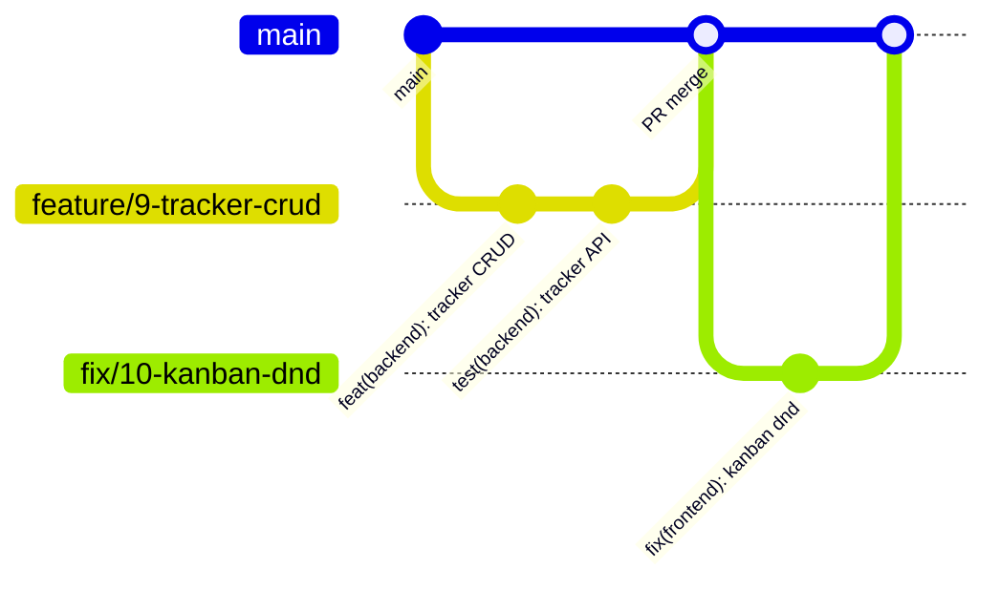

# Branch Workflow — Trunk-Based Scrum

Short-lived branches off `main` for a 2-person team shipping V1 by **July 10, 2026**. No long-lived `develop` branch.

Full label and PR rules: [GITHUB_CONVENTIONS.md](GITHUB_CONVENTIONS.md).

---

## Overview



1. Branch from latest `main`
2. Commit often with [conventional messages](COMMIT_CONVENTIONS.md)
3. Open draft PR early
4. Partner reviews within 24h
5. Squash merge to `main`
6. Delete branch

---

## Branch naming

Three branch types only:

| Pattern | When | Example |
| :--- | :--- | :--- |
| `feature/<issue#>-<slug>` | New capability | `feature/12-agent-update-application` |
| `fix/<issue#>-<slug>` | Something broken on `main` | `fix/10-kanban-dnd` |
| `chore/<issue#>-<slug>` | CI, deps, docs, setup, research | `chore/6-ci-pipeline` |

**Rules:**

- Use lowercase and hyphens in `<slug>`
- Always include the GitHub issue number
- One branch per issue (don't mix unrelated work)
- Rebase or merge `main` into your branch if it's behind before requesting review

---

## Daily workflow

### Starting work

```bash
git checkout main
git pull origin main
git checkout -b feature/9-tracker-crud-api
```

### During work

- Commit small, logical changes
- Push branch and open **draft PR** when you have something reviewable
- Link issue: `Closes #9` in PR description
- Assign partner as reviewer

### Finishing work

```bash
git push origin feature/9-tracker-crud-api
# Mark PR ready for review; partner approves; squash merge via GitHub UI
git checkout main
git pull origin main
git branch -d feature/9-tracker-crud-api
```

---

## Sprint workflow

### Monday — Sprint planning (30 min)

1. Review [PROJECT.md Section 18](PROJECT.md#18-sprint-schedule--github-backlog) for sprint goal
2. Move committed issues to project board **Sprint** column
3. Apply `sprint:N` label; remove old sprint labels
4. Assign Person A / Person B; confirm WIP ≤2 each
5. Create any missing sub-issues under epics

### Daily

- Pull latest `main` before branching
- Update issue status on project board
- Flag `blocked` label + comment if stuck >1 day

### Wednesday + Friday — Sync (15 min)

- What shipped? What's blocked?
- If behind: apply [cut order](PROJECT.md#14-risks--cut-order) from PROJECT.md

### Friday — Sprint review + retro (30 min)

1. **Review:** Demo against phase definition-of-done
2. Move incomplete issues to next sprint (update `sprint:N` label)
3. **Retro:** What blocked us? Pair on hard merges?
4. Close epic sub-issues that met acceptance criteria

---

## Hotfixes

For production-breaking bugs on `main`:

```bash
git checkout main
git pull origin main
git checkout -b fix/99-auth-redirect-loop
# fix, commit, push
# Open PR — tag priority:P0 — fast-track review same day
```

Do not stack unrelated features on a hotfix branch.

---

## Merge strategy

| Strategy | When |
| :--- | :--- |
| **Squash merge** | Default — one commit per issue on `main` |
| **Merge commit** | Avoid unless preserving a carefully structured branch history |
| **Rebase merge** | Optional for very clean linear history; coordinate with partner |

After squash merge, the PR title becomes the commit subject — make it follow [COMMIT_CONVENTIONS.md](COMMIT_CONVENTIONS.md).

---

## Conflict prevention

From [PROJECT.md Section 13](PROJECT.md#13-team--working-agreements):

- API contract defined in Phase 0 before parallel work
- Never both edit the same files in the same session
- Person A owns `frontend/`, deploy, agent UI
- Person B owns `backend/ml/`, models, agent tools, eval
- Shared files (`data model`, `agent integration`) — pair or sequence explicitly

If conflicts happen:

1. Person who didn't cause the conflict pings partner
2. Pair on resolution in a short call
3. Re-run full CI before merge

Time-boxed research or open decisions use a **`chore/`** branch (e.g. `chore/8-eval-auth-options`). Document the outcome in the issue; open a `feature/` issue for what you build next.

---

## Release tagging (July 10)

When V1 milestone `v1.0.0-jul10` is met:

```bash
git checkout main
git pull origin main
git tag -a v1.0.0-jul10 -m "V1: tracker, matcher, tailoring, agent, eval smoke"
git push origin v1.0.0-jul10
```

Create a GitHub Release from the tag with demo video link and eval metrics.

---

## Related docs

- [GITHUB_CONVENTIONS.md](GITHUB_CONVENTIONS.md)
- [COMMIT_CONVENTIONS.md](COMMIT_CONVENTIONS.md)
- [PROJECT.md Section 18](PROJECT.md#18-sprint-schedule--github-backlog)
